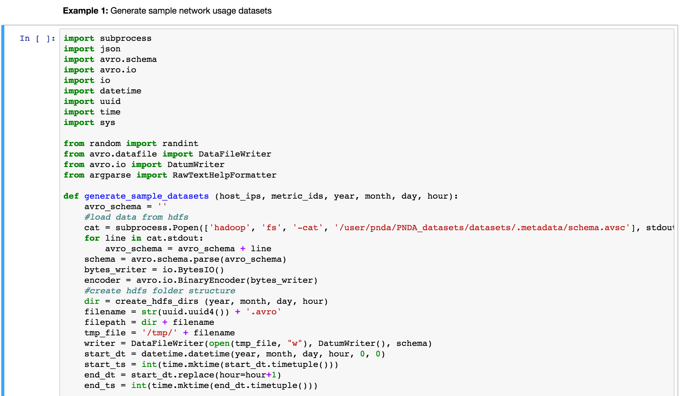
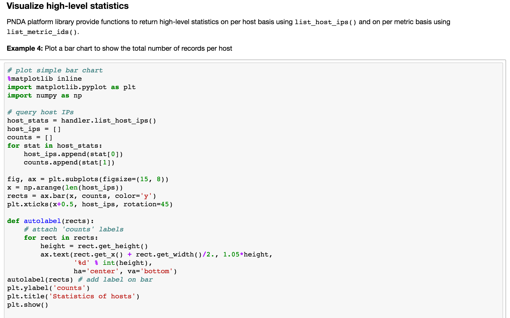
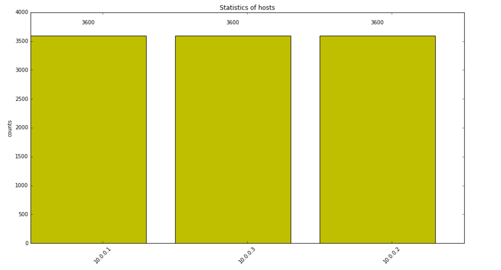
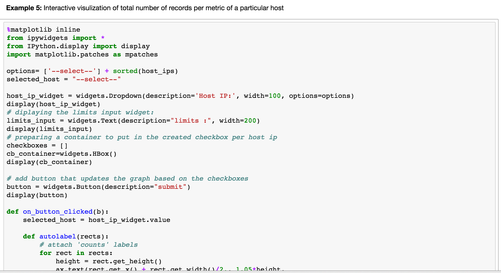
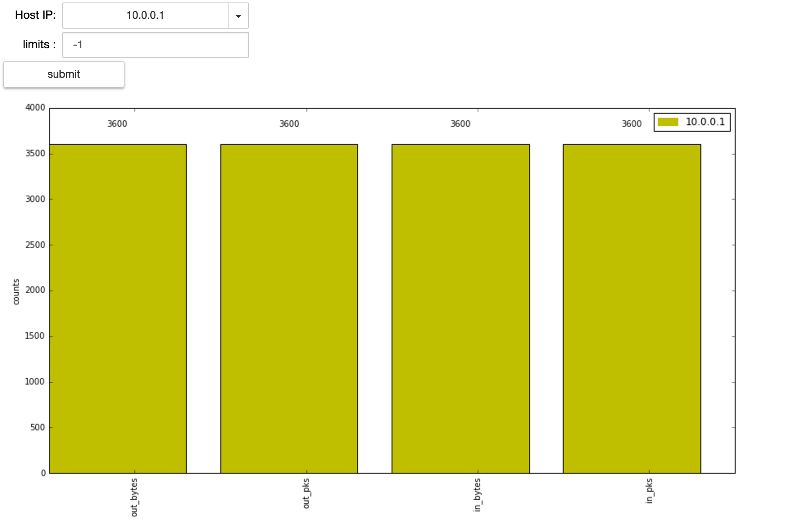
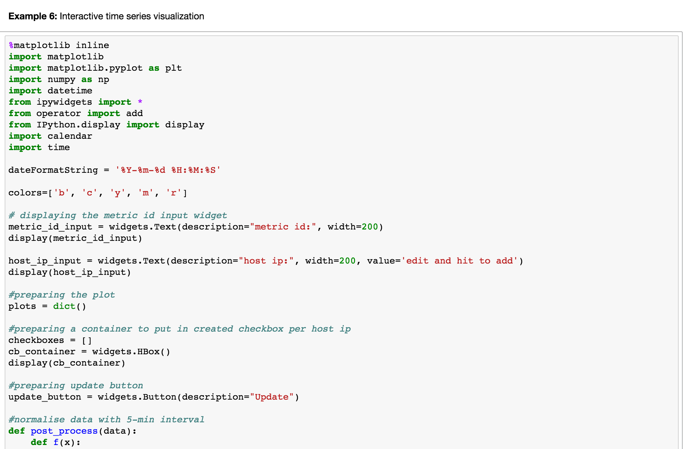
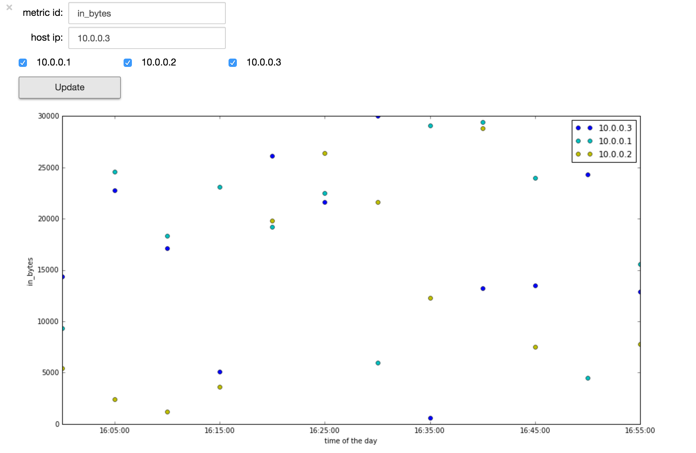
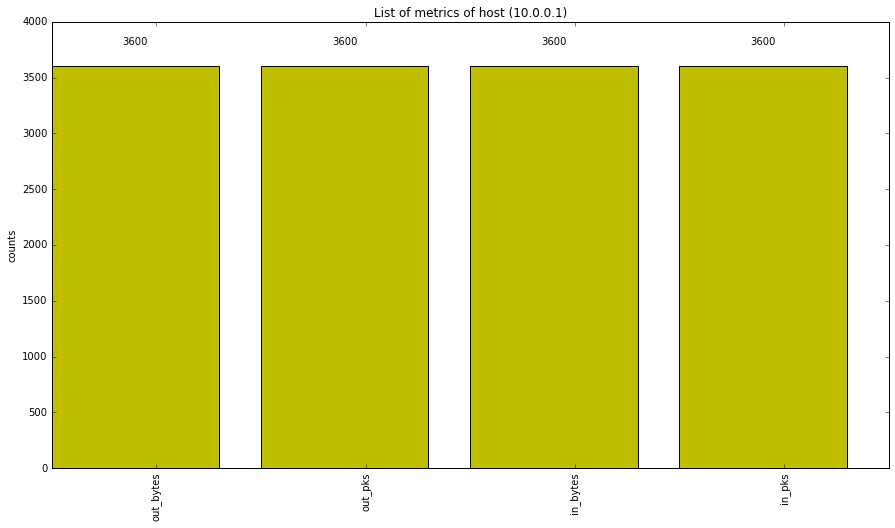
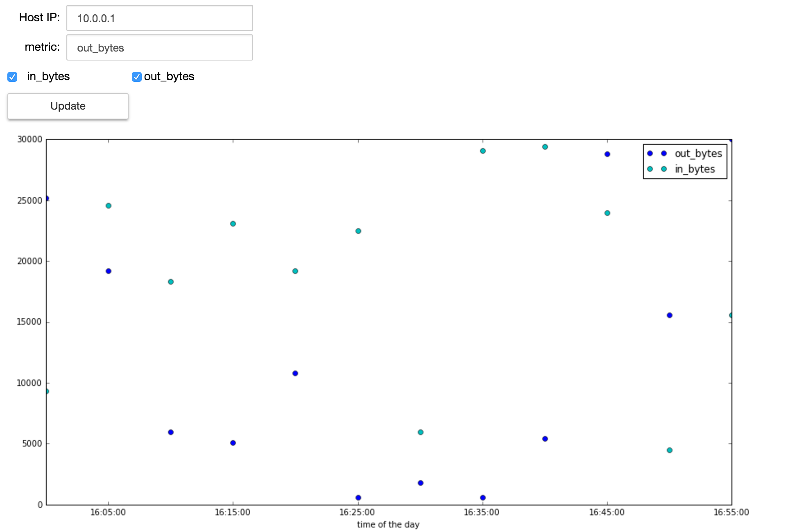

# Exploratory data analytics tutorial

## Objectives ##

This tutorial demonstrates how to use [Jupyter](jupyter.md) to access data and make sense of data interactively using the Jupyter pyspark interpreter. This tutorial uses the PNDA [example notebook](../repos/example-jupyter-notebooks/README.md), where you should be able to find how to connect and upload the example notebook to the Jupyter server on your PNDA cluster. 

## Technical Accomplishments ##

By the end of this Lab, you should be able to:

- Generate sample PNDA data using the data generation tool
- Load data using PNDA platform libraries
- Get high-level data statistics using low-level RDD APIs
- Get high-level data statistics using JsonDataHandler
- Explorary analytics using JsonDataHandler
- Create interactive UIs
- Make a Matplotlib visualization 

## Example notebook overview ##

The example notebook consists of four main sections, which gives you step-by-step tutorials on how to use Jupyter and PNDA platform for interactive data explorations. Each section contains one or more example codes/cells. These examples should be executable, but make sure you run them in sequence. Challenges are also provided for you to play. You can find answers at the end of this tutorial.

## Section 1: Generate sample datasets ##

This first thing you will need for this tutorial is having access to sample [PNDA datasets](../producer/data-preparation.md). If you don't have existed datasets, you can generate test sample datasets using data generator tool, which is deployed on Jupyter node automatically when launching a PNDA cluster. Below is example commands to generate example network usage datasets. 

```
$ ssh cloud-user@<jupyter-node-ip>
$ ls
data_generator.py  platformlibs-0.6.8-py2.7.egg
$ ./data_generator.py --hosts 10.0.0.1,10.0.0.2,10.0.0.3 --metrics in_bytes,out_bytes,in_pkts,out_pkts --year 2016 --month 4 --day 26 --hour 16
Success: generated file path at /user/pnda/PNDA_datasets/datasets/source=test/year=2016/month=04/day=26/hour=16/c36a5209-925a-48b5-9620-214059cf7b74.avro
```
On success, you should be able to see dataset file is saved in HDFS with absolute file path printed. 

Alternatively you can simply run "Example 1: Generator sample network usage datasets" cell. 

 

On completion, you should see a similar output appended under the cell. 

 

## Section 2: Play with RDD ##

Loading data from HDFS can be done using PNDA [platform libaries](../repos/platform-libraries/README.md), see example 2 cell as below. The first line of code is required to add PNDA PNDA [platform libaries](../repos/platform-libraries/README.md) to Spark context, followed by an import statement. In this case, we use JsonDataHandler implementation that was designed to process `rawdata` encoded in JSON format. Finally instantiate a JsonDataHandler instance by injecting Spark Context instance, data source name, and relative file path in HDFS. 

Highlight the cell below "Example 2: Create an instance of JsonDataHandler" and run. 

 

When finished, data should be loaded as a RDD. You can then perform simple data transformation and action using low-level RDD APIs. Example 3 provided some basic operations that allow you to get an insight of the example datasets. 

 

Highlight the cell below "Example 3: Simple RDD operations" and run. On completion, you should get a pending output as below, which prints the total number of records, the first record, and the unique list of monitored host ips. 

 

Go on and finish "Challenge 1" or copy the solution from [Solutions](#challenge-1)

## Section 3: Visualize high-level statistics ##

In this section, we will learn how to use PNDA [platform libaries](../repos/platform-libraries/README.md) and matplotlib to visualize datasets. 

Example 4 gives an example usage of `list_host_ip()` API, which returns a list of ("host_ip", "total number of records") pairs. 



The output is plotted as a bar chart. As the sample data are equally generated on per second, per host basis, all bars are of the same height. 



Go on and finish "Challenge 2" or copy the solution from [Solutions](#challenge-2)

## Section 4: Introducing interactive UI ##

This section showed how to use interactive widgets to build interactive visualizations. 



Example 5 fulfil the similar logic as Challenge 2, but in an interactive way. 

Highlight the cell below "Example 5: Interactive visulization of total number of records per metric of a particular host" and run. You should notice there are not outputs appended as previous examples. Instead an interactive UI is displayed. 


Click the "Host IP:" dropdown UI and select a host ip, set limit (number of metrics to be return; set minus value meaning no limit), and click the submit button. You should see a plot generated as below. Plot can be different depending on your inputs. 



Example 6 is an another interactive visualization example to plot time-series data via the general query interface, `execute_query()`. 


Highlight the cell below "Example 6" and click run. You should see three UI elements displayed as below. 


Type a metric (e.g. in_bytes) you would like compare across hosts in the "metric id" text input widget. In the "host ip" input widget, type a host ip (e.g. 10.0.0.1) and click "enter". You should be able to see an option displayed. Retyping and click to include all hosts. When finished, you can now click update button and get a scattered chart as blow. 



This example showed how to use Jupyter to interactively find out traffic blackhole of a network. Now go on with Challenge 3 and find out packet/bytes drops of a partiular host. Solution to challenge 3 can be found from the [Solutions](#challenge-3) section.


## Solutions ##

Copy and paste solutions to specific Challenge cell in the example notebook and run. 

#### Challenge 1 ####

```
metrics = rdd.flatMap(lambda x: x['rawdata'].items()).map(lambda x : x[0]).distinct().collect()
print len(metrics)
print metrics
```
Expected output:
```
4
[u'out_pks', u'in_bytes', u'in_pks', u'out_bytes']
```

#### Challenge 2 ####

```
# plot simple bar chart
%matplotlib inline 
import matplotlib.pyplot as plt
import numpy as np

# query metric lists
host_ip = "10.0.0.1"
filters = {"host_ips":[host_ip]}
metric_list = handler.list_metric_ids(filters=filters)

def autolabel(rects):
    # attach 'counts' labels
    for rect in rects:
        height = rect.get_height()
        ax.text(rect.get_x() + rect.get_width()/2., 1.05*height,
                '%d' % int(height),
                ha='center', va='bottom')
  
if len(metric_list) > 0:
    host_ip = metric_list[0][0]
    stats = metric_list[0][1]

    metric_ids=[]
    metric_counts=[]
    for stat in stats:
        metric_ids.append(stat[0])
        metric_counts.append(stat[1])
    x = np.arange(len(metric_ids))
    fig, ax = plt.subplots(figsize=(15, 8))
    metric_rects = ax.bar(x, metric_counts, color='y')
    plt.xticks(x+0.5, metric_ids, rotation='vertical') 
    plt.ylabel ('counts')
    plt.title('List of metrics of host (%s)' % host_ip)
    autolabel(metric_rects)
    plt.draw()
```

Expected output:




#### Challenge 3 ####

```
%matplotlib inline
import matplotlib
import matplotlib.pyplot as plt
import numpy as np
import datetime
from ipywidgets import *
from operator import add
from IPython.display import display
import calendar
import time

dateFormatString = '%Y-%m-%d %H:%M:%S'

colors=['b', 'c', 'y', 'm', 'r']

# displaying the metric id input widget
# metric_id_input = widgets.Text(description="metric id:", width=200)
host_ip_input = widgets.Text(description="Host IP:", width=200)
display(host_ip_input)

metric_input = widgets.Text(description="metric:", width=200, value='edit and hit to add')
display(metric_input)

#preparing the plot 
plots = dict()  

#preparing a container to put in created checkbox per host ip
checkboxes = []  
cb_container = widgets.HBox()  
display(cb_container)

#preparing update button
update_button = widgets.Button(description="Update")

#normalise data with 5-min interval
def post_process(data):
    def f(x): 
        sum_val = 0
        for val in x:
            sum_val = sum_val + x[0][1]
        return sum_val
    data_rdd = sc.parallelize(data).map(lambda x: (x[0], int(x[1]))).foldByKey(0, add).sortBy(lambda x: x[0]).groupBy(lambda x : (calendar.timegm(time.strptime(datetime.datetime.fromtimestamp(x[0]/1000).strftime('%Y-%m-%d %H:%M:%S'), dateFormatString))/(5*60))).map(lambda x : (x[0],list(x[1]))).mapValues(f).map(lambda x: (datetime.datetime.fromtimestamp(x[0] * 6*50), x[1]))
    return data_rdd.keys().collect(), data_rdd.values().collect()

#function to deal with the added host ip
def handle_submit(sender):  
    exists = False
    for cb in checkboxes:
        if cb.description is metric_input.value:
            exists = True
    if not exists and len(checkboxes)<5:
        #add a new checkbox for the new host ip
        checkboxes.append(widgets.Checkbox(description = metric_input.value, value=True, width=90))
        cb_container.children=[i for i in checkboxes]
        if len(checkboxes) == 1:
            display(update_button)

#function to deal with the checkbox update button       
def on_button_clicked(b): 
    filters = {}
    filters['host_ips']=[host_ip_input.value]
    
    metric_ids = []
    for c in cb_container.children:
        if c.value:
            metric_ids.append(c.description)            
    filters['metrics'] = metric_ids

    results = handler.execute_query(filters=filters)

    i=0
    if len(results) > 0:
        # Plot things...
        fig = plt.figure(figsize=(15, 8))
        ax=fig.add_subplot(111)
        for result in results:
            label = result[0][0]
            timestamps, values = post_process(result[1])
            ax.plot_date(timestamps, values, c=colors[i], label=label)
            i=i+1
        ax.xaxis.set_major_formatter(matplotlib.dates.DateFormatter("%H:%M:%S"))
        plt.xlabel("time of the day")
        plt.legend(loc='upper right')
        plt.gray()    
        plt.show()
        
update_button.on_click(on_button_clicked)  
metric_input.on_submit(handle_submit)  
```

Expected output:


