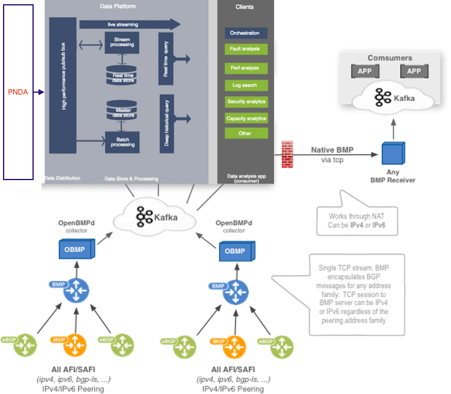

# Integrating OpenBMP

You can integrate [OpenBMP](http://www.openbmp.org/) with PNDA using Logstash.

## OpenBMP-PNDA Flow

BMP devices (e.g. routers) send BMP messages to an OpenBMP collector/daemon. One OpenBMP daemon can handle many routers and bgp peers, but in a large network with transit links and full internet routing tables, multiple OpenBMP collectors are recommended. Simply configure on the BMP device (router) which BMP server should be used.

The Kafka data bus gives many batch/streaming applications the ability to tap into existing BMP feeds from any number of routers. A single BMP feed via OpenBMP can feed data into hundreds of consumer apps, such as Apache Spark, HBase, Real-time monitors, flat files, ELK, etc.

An OpenBMP forwarder can be used to forward native BMP messages (without  modification) to any other BMP receiver, including openbmpd.

Admins, Network Engineers, automated programs/scripts, etc. can interact with the OpenBMP API or any other consuming application.

## Installation

In this example, we will use one `collector` instance.

### Requirements

These instructions are designed to be followed on Ubuntu, or a similar Debian-based Linux operating system.

### Daemon

The OpenBMP daemon is a BMP receiver for devices or software that implement BMP, such as Cisco and Juniper routers. The collector is a highly scalable producer for Apache Kafka. Both RAW BMP messages and parsed messages are produced for Kafka consumer consumption.

### Setup Collector

A collector container is a container for collecting BMP messages from BMP senders, e.g. routers. This container can be distributed.

Refer to the [OpenBMP collector](https://github.com/OpenBMP/docker/blob/master/collector/README.md) guide to get the collector up and running.

Verify if the collector is up and running:

    cloud-user@openbmp-collector:~$ sudo docker ps
    CONTAINER ID        IMAGE               COMMAND             CREATED             STATUS              PORTS                    NAMES
    3658c7878e0d        openbmp/collector   "/usr/sbin/run"     2 minutes ago       Up 1 minute          0.0.0.0:5000->5000/tcp   openbmp_collector

### Setup Kafka

You can choose to install a [pre-configured](https://github.com/OpenBMP/docker/tree/master/kafka) `kafka collector` or install your own. Here are instructions for setting up Kafka manually.

#### Prerequisites

Install Java (if you haven't already):

    sudo add-apt-repository ppa:webupd8team/java
    sudo apt-get update
    sudo apt-get install oracle-java8-installer

#### Kafka

Install Kafka (0.8.x recommended):

    wget http://www.mirrorservice.org/sites/ftp.apache.org/kafka/0.8.2.0/kafka_2.11-0.8.2.0.tgz
    tar -zxvf kafka_2.11-0.8.2.0.tgz
    cd kafka_2.11-0.8.2.0

Start Zookeeper (simple deployment):

    nohup bin/zookeeper-server-start.sh config/zookeeper.properties > zookeeper.out &

Start the Kafka server:

    nohup bin/kafka-server-start.sh config/server.properties > kafka-server.out &

You are now ready to direct bmp data to the collector.

#### Validation

If you have bmp data flowing to the collector, you should see some kafka topics already created.

    cloud-user@openbmp-kafka:~/kafka_2.10-0.8.2.0$ bin/kafka-topics.sh --list --zookeeper localhost:2181
    __consumer_offsets
    openbmp.bmp_raw
    openbmp.parsed.base_attribute
    openbmp.parsed.bmp_stat
    openbmp.parsed.collector
    openbmp.parsed.ls_link
    openbmp.parsed.ls_node
    openbmp.parsed.ls_prefix
    openbmp.parsed.peer
    openbmp.parsed.router
    openbmp.parsed.unicast_prefix

To know more about their data format, refer to the [Message Bus API](http://www.openbmp.org/#!docs/MESSAGE_BUS_API.md).

### Install Logstash

Logstash is a flexible, open source data collection, enrichment, and transport pipeline designed to efficiently process a growing list of log, event, and unstructured data sources for distribution to a variety of outputs, including Elasticsearch.

Install and configure Logstash by following [these installation instructions](https://github.com/pndaproject/logstash-codec-pnda-avro).

### Example Logstash Configuration

As an example, we will see how to read data from the `openbmp.parsed.unicast_prefix` topic and send it to PNDA.

Assuming the PNDA kafka instances IP are `192.168.0.100` and `192.168.0.101`:

    input {
      kafka {
        zk_connect => "localhost:2181" # point to the kafka instance IP
        topic_id => "openbmp.parsed.unicast_prefix"
      }
    }
    
    filter {
      mutate {
          add_field => {
              "src" => "unicast_prefix"
              "host_ip" => "localhost" # change the IP and set something meaningful
          }
          rename => { "message" => "rawdata" }
          ruby {
              code => "event.set('timestamp', (event.get('@timestamp').to_f * 1000).to_i)"
          }
      }
    }
    
    output {
        kafka {
          bootstrap_servers => "192.168.0.100:9092,192.168.0.101:9092" # change the broker list IPs
          topic_id => "avro.openbmp.unicast_prefix"
          compression_type => "none" # "none", "gzip", "snappy", "lz4"
          value_serializer => 'org.apache.kafka.common.serialization.ByteArraySerializer'
          codec => pnda-avro { schema_uri => "/home/cloud-user/pnda.avsc" }
        }
    }

Save the above configuration in `logstash.conf`.

Then run logstash:

    bin/logstash agent -f logstash.conf

You should see a `Logstash startup completed` message printed on the console. If you don't see this message, something went wrong in your setup or there's an error in your configuration.

For more information on Logstash, refer to the [Logstash guide](https://www.elastic.co/guide/en/logstash/current/index.html).

You can also get some usefull information of Logstash configuration with OpenBMP on [this link](https://github.com/OpenBMP/openbmp/blob/master/docs/LOGSTASH.md).
