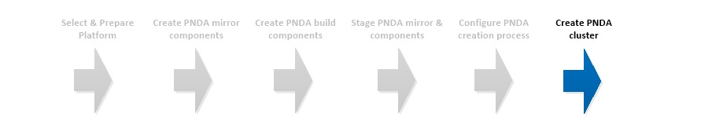

# Create PNDA cluster



## Introduction

With the target platform fully prepared, the PNDA software staged and the YAML configuration completed, the final step is to invoke the PNDA CLI to create the cluster.

## Create PNDA

#### Install CLI dependencies

To use the PNDA command line interface, you will need to install the python, heat and nova clients. To install them on CentOS, run:

```
sudo yum install -y epel-release
sudo yum install -y python python-pip python-devel gcc

cd cli
sudo pip install -r requirements.txt
sudo pip install jinja2 --upgrade
```

#### CLI invocation

The pnda-cli.py script allows launching a PNDA deployment. It sits in the cli subdirectory.
To launch PNDA on Openstack please proceed to [pndacli repository](https://github.com/pndaproject/pnda-cli).

Make sure you have access to the private key of this key pair otherwise you will not be able to connect to the bastion node and access the cluster.

**Important:** ensure you are certain what version of PNDA you want to deploy. In most circumstances you'll want to make sure the branch or tag you specify is identical to the branch or tag you used to build the PNDA mirror, and identical to the version you checked out from the pnda-cli repository. All PNDA releases are designated with a tag such as ```release/4.0``` across all repositories.

# [Home](../OVERVIEW.md)

| [Home](../OVERVIEW.md) | [Prepare](PREPARE.md) | [Mirror](MIRROR.md) | [Build](BUILD.md) | [Stage](STAGE.md) | [Configure](CONFIGURE.md) | [Create](CREATE.md) | 
| --- | --- | --- | --- | --- | --- | --- | 
