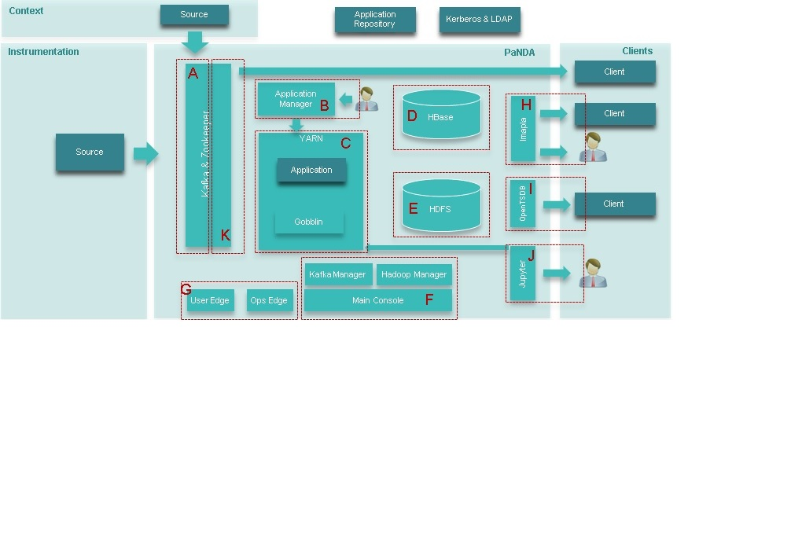
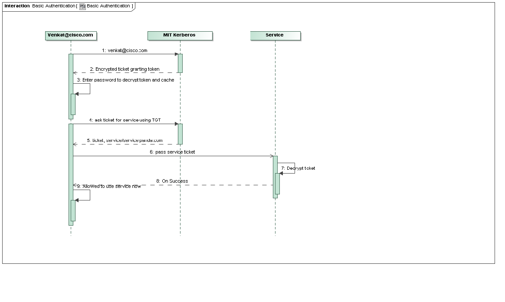
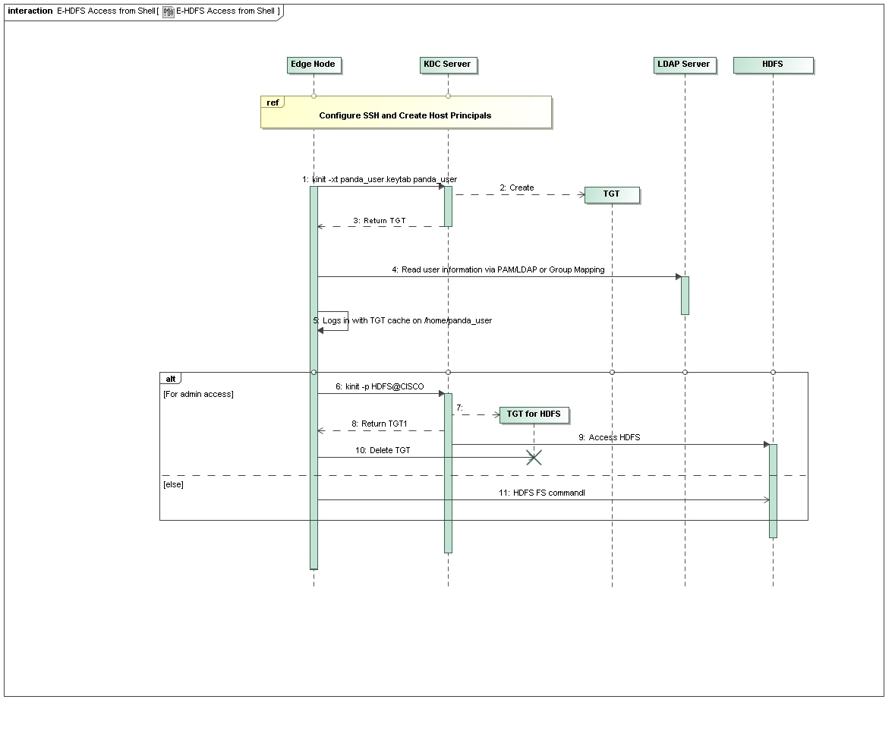

# Security

* [Introduction](#introduction)
* [Architecture](#architecture)
* [Background](#background)
  * [Kerberos](#kerberos)
  * [End User Accounts](#end-user-accounts)
  * [Use of LDAP](#use-of-ldap)
  * [User Accounts for Daemons](#user-accounts-for-daemons)
* [Components](#components)
    * [Kafka](#kafka)
    * [Deployment Manager](#deployment-manager)
    * [Application Security](#application-security)
      * [Batch Apps](#batch-apps)
      * [Streaming Apps](#streaming-apps)
      * [Gobblin](#gobblin)
    * [HBase](#hbase)
    * [HDFS](#hdfs)
    * [Impala](#impala)
    * [OpenTSDB](#opentsdb)
    * [Console Security](#console-security)
      * [Cloudera Manager](#cloudera-manager)
      * [Hue](#hue)
      * [Main console](#main-console)
      * [Web consoles](#web-consoles)
    * [Perimeter Security](#perimeter-security)
      * [EdgeNode](#edgenode)
* [Conclusion](#conclusion)
  
# Introduction

A big data infrastructure like PNDA involves a multitude of technologies and tools. Providing enterprise-grade security for such a system is not only complex, but is of primary concern for any production deployment. The PNDA team is working on a “security blueprint” that addresses each component, and the system as a whole. It’s not yet ready, but what follows is a discussion of some the main issues we’re considering, the direction we’re heading in, and the current thinking on how each component will be secured.


# Architecture



# Background #

## Kerberos

In the world of [Kerberos](http://web.mit.edu/kerberos/), each client or service is identified by the principal. At all times, the KDC (Key Distribution Center) server maintains a list of all principals in its internal database, coordinates authentication requests across nodes, and assures that everyone is who they say they are.


## End User Accounts

Some underlying technologies in PNDA, such as Kafka, Hadoop, and HBase, don't include support for users. They rely on the UNIX users of the node on which they are run. Kerberos user principals typically have the format `username@realm.com`.  Hadoop converts  this two part principal into local Unix user name by stripping of domain name.


## Use of LDAP

PNDA is a complex system involving multiple nodes. In order to synchronize all user and group level mappings in one place, our intention is to leverage an LDAP directory and configure nodes to resolve enterprise users via [PAM](http://linux.die.net/man/5/pam_ldap).

## User Accounts for Daemons

The core services are runs as UNIX daemons under the same name as local UNIX user. For example, HDFS is run as the `hdfs` user and HBase is run as the `hbase` user, sharing a common group called `hadoop`.  These users by design are assigned 'super user' status. To prevent malicious attacks and for added security, they can possibly be created as UNIX users on nodes and be white-listed from submitting any jobs.

# Components

The first step in securing any system is authenticating the user, in other words identifying who they claim to be, before they are allowed to use any services. Kerberos forms the basis of authentication in PNDA. 

The second step is authorizing the user, that is to say  identifying what an authenticated user can access in regard to data, cluster resources, etc.

In the following sections, we go into detail how we plan to tackle some of these concerns with regard to each component.

## Kafka

Authentication of Kafka from clients (producers and consumers) can be supported using either SSL and/or SASL. How data gets ingested into the platform will determine the security configuration of Kafka. If data producers are running in the same environment as PNDA, then Kerberos is the preferred choice (as Kerberos authentication requires access to KDC and Active Directory). On another hand, if outside clients ingest data into Kafka, it can be configured to run SSL.
For more details about Kafka security, check [Kafka Broker Security](http://kafka.apache.org/documentation.html#security_configbroker)

If Kafka runs SSL scheme, clients can authenticate themselves by setting the following properties: 

    security.protocol=SSL
    ssl.keystore.location=/var/private/ssl/kafka.client.keystore.jks
    ssl.keystore.password=xxxx
    ssl.key.password=xxxx
    

In case of Kerberos, clients can authenticate themselves by passing JAAS file as an argument `-Djava.security.auth.login.config=/etc/kafka/logstash_jaas.conf` to  JVM. The following is one such example configuration of JAAS:

    KafkaClient {
       com.sun.security.auth.module.Krb5LoginModule required
       useKeyTab=true
       storeKey=true
       keyTab="/etc/security/keytabs/kafka_client.keytab"
       principal="logstash@pnda.com";
    };
    
Also, the following settings need to be added as part of clients' properties:

    security.protocol=SASL_PLAINTEXT (or SASL_SSL)
    sasl.kerberos.service.name=kafka
    
Authentication is only part of a story; Kafka also needs to have authorization rules regarding who is allowed to `CREATE/READ/WRITE` on specific topics.

Kafka ACLs are specified in a general format of  “Principal P is [Allowed/Denied] Operation O From Host H On Resource R.” Common use cases about configuring Authorization include the following:

- Authorization rights for Kafka Manager to create a `topic` with `CREATE` and `DESCRIBE` permission.
- Producers need `WRITE` permission on the `topic`
- Consumers need `READ` permission on `topic` and `consumer-group`

The above discussion is about how Security can be enabled since the Kafka 0.9.0 release. Work is still ongoing for some dependent components such as Logstash, Kafka manager, and the Spark-Kafka connector.

### Example using SASL_SSL / ACL on a secure Kafka & clients

Let's consider that you have generated the right keys and certificate. In this example, we will use Kafka 10.0.1 and will just use PLAIN/JAAS files for authentication.

1. the first step is to secure the Kafka broker:

  * server.properties configuration file looks like:

```properties
    broker.id=0
    delete.topic.enable=true
    listeners=SASL_SSL://:9093
    security.inter.broker.protocol=SASL_SSL
    num.network.threads=3
    num.io.threads=8
    socket.send.buffer.bytes=102400
    socket.receive.buffer.bytes=102400
    socket.request.max.bytes=104857600
    log.dirs=/opt/pnda/kafka_2.11-0.10.0.0/data/kafka-logs
    num.partitions=1
    num.recovery.threads.per.data.dir=1
    log.retention.hours=168
    log.segment.bytes=1073741824
    log.retention.check.interval.ms=300000
    zookeeper.connect=localhost:2181
    zookeeper.connection.timeout.ms=6000
    security.protocol=SASL_SSL
    ssl.client.auth=required
    ssl.keystore.location=/opt/pnda/server.keystore.jks
    ssl.keystore.password=test1234
    ssl.key.password=test1234
    ssl.truststore.location=/opt/pnda/server.truststore.jks
    ssl.truststore.password=test1234

    sasl.enabled.mechanisms=PLAIN
    sasl.mechanism.inter.broker.protocol=PLAIN
    authorizer.class.name=kafka.security.auth.SimpleAclAuthorizer
    super.users=User:admin
```

  * the JAAS file containing authentication, named config/kafka_server_jaas.conf

```properties
    KafkaServer {
      org.apache.kafka.common.security.plain.PlainLoginModule required
      username="admin"
      password="admin"
      user_admin="admin"
      user_test="test"
      user_pnda="pnda"
    };
```

  * now, you can launch the broker:

```sh
    cd /opt/pnda/kafka_2.11-0.10.0.0
    export KAFKA_OPTS="-Djava.security.auth.login.config=/opt/pnda/kafka_2.11-0.10.0.0/config/kafka_server_jaas.conf"
    bin/kafka-server-start.sh config/server-ssl-sasl.properties
```

  * creating ACL on the broker, let's create ACL for a consumer, the test user and ACL for a producer, the pnda user

```sh
   cd /opt/pnda/kafka_2.11-0.10.0.0
   bin/kafka-acls.sh --authorizer-properties zookeeper.connect=localhost:2181 --add --allow-principal User:test --consumer --topic avro.log.test --group test
   bin/kafka-acls.sh --authorizer-properties zookeeper.connect=localhost:2181 --add --allow-principal User:pnda --producer --topic avro.log.test
```

  * check the ACLs:
```sh
    cd /opt/pnda/kafka_2.11-0.10.0.0
    bin/kafka-acls.sh --authorizer-properties zookeeper.connect=localhost:2181 --list 


    Current ACLs for resource `Group:test`: 
      User:test has Allow permission for operations: Read from hosts: * 

    Current ACLs for resource `Topic:avro.log.test`: 
      User:pnda has Allow permission for operations: Describe from hosts: *
      User:pnda has Allow permission for operations: Write from hosts: *
      User:test has Allow permission for operations: Read from hosts: *
      User:test has Allow permission for operations: Describe from hosts: * 

    Current ACLs for resource `Cluster:kafka-cluster`: 
      User:pnda has Allow permission for operations: Create from hosts: * 
```

2. Now on the consumer side, you will need so configure:

  * the consumer.properties configuration file

```properties
    group.id=test
    security.protocol=SSL
    ssl.keystore.location=/opt/pnda/server.keystore.jks
    ssl.keystore.password=test1234
    ssl.key.password=test1234
    security.protocol=SASL_SSL
    sasl.mechanism=PLAIN
```

  * the JAAS file named kafka_client_jaas_consumer.conf

```properties
    KafkaClient {
        org.apache.kafka.common.security.plain.PlainLoginModule required
        username="test"
        password="test";
    };
```

  * now you can launch the consumer:

```sh
    export KAFKA_OPTS="-Djava.security.auth.login.config=/opt/pnda/kafka_2.11-0.10.0.0/config/kafka_client_jaas_consumer.conf"
    cd /opt/pnda/kafka_2.11-0.10.0.0
    bin/kafka-console-consumer.sh --bootstrap-server localhost:9093 --topic avro.log.test --consumer.config config/consumer.properties --new-consumer
```

3. On the producer side, this is quite the same:

  * the producer.properties configuration file:

```properties
    security.protocol=SSL
    ssl.keystore.location=/opt/pnda/server.keystore.jks
    ssl.keystore.password=test1234
    ssl.key.password=test1234
    security.protocol=SASL_SSL
    sasl.mechanism=PLAIN
```

  * the JAAS file named kafka_client_jaas_producer.conf

```properties
    KafkaClient {
        org.apache.kafka.common.security.plain.PlainLoginModule required
        username="pnda"
        password="pnda";
    };
```

  * now you can launch the producer in a new windows:

```sh
    export KAFKA_OPTS="-Djava.security.auth.login.config=/opt/pnda/kafka_2.11-0.10.0.0/config/kafka_client_jaas_producer.conf"
    cd /opt/pnda/kafka_2.11-0.10.0.0 
    bin/kafka-console-producer.sh --broker-list localhost:9093 --topic avro.log.test --producer.config config/producer.properties 
```

4. Then on the producer window, you can type some message and you should see them on the consumer window.

5. You can also use the kafka clients provided [here](https://github.com/pndaproject/example-kafka-clients). As for example, the python client use the new Kafka API:

```python
  ctx = ssl.SSLContext(ssl.PROTOCOL_TLSv1)
  ctx.load_cert_chain(certfile="../ca-cert", keyfile="../ca-key", password="test1234")
  producer = KafkaProducer(bootstrap_servers=["ip6-localhost:9093"],security_protocol="SASL_SSL",\
    ssl_context=ctx,\
    sasl_mechanism="PLAIN",sasl_plain_username="pnda",sasl_plain_password="pnda")
```

## Deployment Manager

The [Deployment Manager](http://github.com/pndaproject/platform-deployment-manager) performs several actions on a cluster, depending on the type of component being deployed, such as creating a folder, copying files to HDFS, submitting Oozie jobs, etc. For the deployment manager to able to perform these actions on a secure cluster:

- It needs to have a Kerberos principal of its own, with proper authorization rights on HDFS, Oozie, and HBase.
- It needs to authenticate itself by running a `kinit` before accessing REST APIs like HTTPFS or Oozie over SPNEGO.md.


## Application Security


### Batch Apps

Batch applications are submitted to a cluster using the Oozie scheduler. Before we go into details of how application security is supported, it's worth understanding the details of how Oozie works in a secure cluster. The Oozie scheduler primarily consists of two parts, the server and the client. The server, on behalf of the client, submits the end user's jobs to services like ResourceManager or JobTracker. When submitting jobs on a secure cluster, it needs a Kerberos principal of its own. Since some of these jobs may run for days or weeks, credentials are renewed programmatically using a server `keytab` file. 


Does this mean anybody can submit jobs to an Oozie server? Not really. The Oozie client front end can be secured using Kerberos, and the Deployment Manager can authenticate itself using its principal before submitting batch jobs for an application. This way the credentials are validated only during job submission, and Hadoop services will be able to execute long running job requests by validating with the Oozie server credentials. 

Can authorization rules be applied for a user without them ever providing their credentials? This is where the proxy user comes in, using a technique called *impersonation*. The Deployment Manager, when submitting jobs can impersonate on the real user's behalf using the `-doas` option of the Oozie API.


### Streaming Apps

For long-running apps, such as ones that use Spark Streaming, to be able to write to HDFS or use YARN, it is possible for the application to pass a principal and a keytab to spark-submit via the `--principal` and `--keytab` parameters, respectively. The keytab passed in will be copied over to the machine running the Application Master via the Hadoop Distributed Cache. (It will be copied securely, if YARN is configured with SSL and HDFS encryption is enabled.) The Kerberos login can be periodically renewed using this principal and keytab, and the delegation tokens required for HDFS access will be generated periodically.

## Gobblin

Gobblin requires a user principal to run long running jobs on a secure cluster. It needs to get a delegation token periodically for accessing cluster resources, which in turn requires it to renew KDC credentials. To run Gobblin on a secure cluster, the `application.conf` file needs the Kerberos principal name and keytab location.
    
    gobblin.yarn.keytab.file.path="/home/gobblin/gobblin.keytab"
    gobblin.yarn.keytab.principal.name=gobblin

## HBase

HBase can be secured using SASL with Kerberos to prevent unauthenticated access to data.  A secure HBase is also dependent on HDFS and Zookeeper being secure, as it uses HDFS to store its data and metadata on Zookeeper.
Once authentication is enabled, clients may have to do login via `kinit` either using the shell or through a Java client.

Often there is a need to access HBase in other languages, like Python or Javascript, via Thrift or REST gateways. For such scenarios, the gateways can be configured to support Kerberos for the front end and allow secure access HBase on the client's behalf using their principal. With impersonation (`doAs`) turned on, HBase can possibliy determine the actual user performing the request for authorization. Authorization in HBase is based on a user’s membership in, or exclusion from, group memberships.

HBase access levels are granted independently of each other, and allow for different types of operations at a given scope:

  * `Read (R)`: can read data at the given scope 
  * `Write (W)`: can write data at the given scope 
  * `Execute (X)`: can execute coprocessor endpoints in the given scope 
  * `Create (C)`: can create tables or drop tables (even those they did not create) at the given scope. The possible scopes are superuser, namespace level, table level and even at column level. 
  
For further information, see chapter 60 in the the [HBase Guide](https://hbase.apache.org/book.html).

## HDFS 

Once a user identifies themself against HDFS through Kerberos, their file or folder ownership is verified against user name and group memberships. However, a simple permission model of the single user and group is insufficient for a multi-tenant platform like PNDA. To support multiple users and group level permission, HDFS can be configured for extended POSIX Access Control Lists (ACLs). An ACL consists of a set of ACL entries. Each ACL entry specifies a name and group and grants read, write or execute permission for a file or folder. The ACL scheme also differentiates between an ‘access ACL’ and ‘default ACL’. Default ACL is what assigned to subfolders and directories when they get created under parent folder.

```
<!-- To give user 'venkat' read & write permission over master data/user/hdfs/file -->
hdfs dfs -setfacl -m user:venkat:rw- /user/gobblin/master/

<!-- To remove user 'james' ACL entry for /user/hdfs/data-analyst -->
hdfs dfs -setfacl -x user:alice /user/hdfs/data-analyst

<!-- To give user hadoop read & write access, and group or others read-only access --> 
hdfs dfs -setfacl --set user:hadoop:rw-,group::r--,other::r-- /user/hdfs/file
```

## Impala

[Impala](../query/impala.md), the open source analytic database for Apache Hadoop, supports authentication using both Kerberos and LDAP. Using LDAP and Kerberos together provides significant value. Kerberos remains the core authentication protocol and is always used when Impala daemons connect to each other and to the Hadoop cluster. LDAP is ubiquitous across the enterprise and is commonly utilized by client applications connecting to Impala via ODBC and JDBC drivers. A mix of the two therefore makes sense in the case of PNDA.


[Ref Impala Security](http://blog.cloudera.com/blog/2014/10/new-in-cdh-5-2-impala-authentication-with-ldap-and-kerberos/)

## OpenTSDB
OpenTSDB is essentially a time series database that runs above HBase. It  consists of TSD( Time Series Daemons) that uses HBase to store and retrieve data. Clients can communicate with TSDs through HTTP API for dashboards or statistical inference. API access to OpenTSDB can simply be secured by running it behind a firewall or an HTTP Server like Ngnix.


## Console Security


###  Cloudera Manager


Cloudera Manager supports many security mechanisms for authenticating users. Within PNDA, we can configure Cloudera Manager to authenticate against an LDAP Server to have a common reference for user accounts.Cloudera Manager supports authorization through user roles. User membership in particular role determines what features are visible to user and actions they can perform.


### Hue

Like Cloudera Manager,  we can also enable LDAP authentication for Hue to have shared repository of enterprise user accounts. Hue can also be configured to support impersonation whereby users logging into console can access all cluster services without actually authenticating themselves against Kerberos.


### Main console

The Main console can implement *LDAP over TLS* as the frontend authentication scheme. Since existing interfaces like Cloudera Manager and Hue also integrate with LDAP, it makes sense to adopt LDAP over TLS as an authentication mechanism. Use of LDAP also argues well for the future, if we need to enable SSO with an enterprise identity provider or integrate with their existing directory service.


### Web consoles

SPNEGO with Kerberos authentication can be configured for the Web UIs of HDFS, YARN, MapReduce2, HBase, Oozie, Spark, etc.


## Perimeter Security

### EdgeNode 

PNDA users who need terminal access to the cluster need to authenticate themselves using Kerberos over SSH at the edge node. SSH can be configured to delegate the `TGT` ticket, thereby allowing the user to access cluster services. SSH with Kerberos provides cryptographic authentication that doesn't give away the user's password, and the ticket cache offers the same advantages as the key agent, allowing for single sign-on.



# Conclusion
As one can see from above discussion, securing a distributed system like PNDA is not only very complicated but equally challenging to meet security needs of a modern enterprise. As part of this blueprint, we barely scratched the surface. There is still a lot to be explored in areas like Transparent Encryption for Data Rest/ Motion, Centralized authorization policy management either through Apache Sentry/Ranger, Data  Audit, Lineage and Redaction needs and Service level requirements regarding Yarn queue consumption, disk quota, etc.


